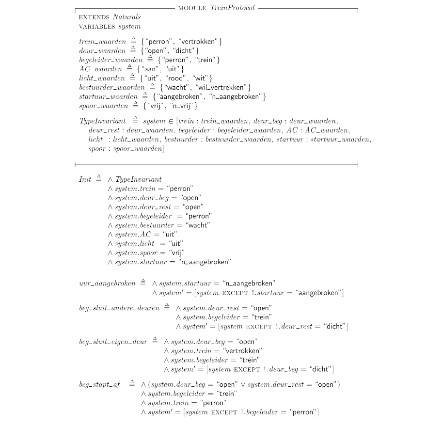
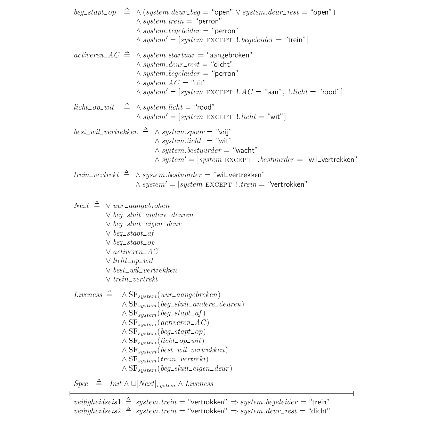

# formal-model-of-a-train-departure

A formal specification of a train departure protocol. This accompanies an evaluation of the train departure protcol of a belgian railroad company and is used to point out problems within their protocol. Also includes an improved version.

The problem with the protocol can be seen in this video:

